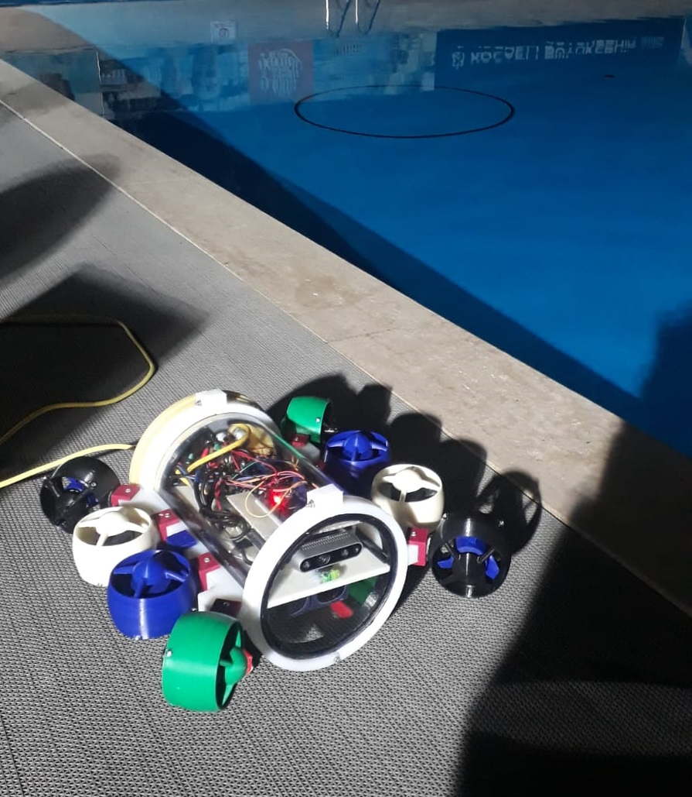

== Gallipoli AUV

ROS-based AUV developed for the competition "Teknofest 2021". All packages tested under ROS Melodic and Ubuntu 18.04.

== Table of Contents
* Hardware
* Thruster Configuration
* Software
** Embedded
*** Used Libraries
*** Messages
*** Topics on Arduino
**** Publishers
**** Subscribers
** Single Board Computer
*** Real-Time Object Detection
*** Teleoperation
*** Mission Software
* Capabilities
* Bringup

== Hardware
* NVIDIA Jetson Nano Developer Kit 4GB
* Arduino Mega 2560 Rev3
* Intel RealSense D435i
* 2x HOBBYWING XRotor Micro 60A +S 4in1 BLHeli_32-DS1200 ESC
* BlueRobotics Bar30 High-Resolution 300m Depth/Pressure Sensor
* BlueRobotics I2C Level Converter

== Thruster Configuration

image::img/img04.png[width=300px]

== Software

=== Embedded
Embedded software developed on Arduino

==== Used Libraries
* Wire, to establish communication with depth sensor via I2C communication.
* Servo, to attach thrusters individually and write PWM signals into them.
* MS5837, depth sensor's library.

===== Messages
* gallipoli_msgs/Motorpwm includes integers in order m1,m2,m3,m4 representing individual PWM signal for each thruster.

=====  Topics on Arduino

====== Publishers
* /depth , publishes the data recieved from depth sensor in meters.

====== Subscribers
* /vertical_pwm , writes the PWM signals into the thrusters responsible for movement in z axis.
* /direction_pwm , writes the PWM signals into the thrusters responsible for movement in x,y axis.

Start serial communication by following line:

[source, bash]
----
rosrun rosserial_arduino serial_node.py _port:=/dev/ttyACM0 _baud:=57600
----

=== Single Board Computer

==== Object Detection

YoloV3 Tiny from the https://github.com/leggedrobotics/darknet_ros[YOLO ROS] package used with the data sets we have created. You only look once (YOLO) is a state-of-the-art, real-time object detection system. In the ROS package I mentioned above, you can use YOLO (V3) on GPU and CPU.

Following lines added into YoloObjectDetector.cpp and BoundingBox.msg  to have center information of detected object:

YoloObjectDetector.cpp, into the function void* YoloObjectDetector::publishInThread()
[source, cpp]
----
int x_center= (xmin + xmax) / 2;
int y_center= (ymin + ymax) / 2;

boundingBox.xcenter = x_center;
boundingBox.ycenter = y_center;
----

BoundingBox.msg:

[source, cpp]
----
int64 xcenter
int64 ycenter
----

==== Teleoperation

To run teleoperation, type the following lines in different terminals:

[source, cpp]
----
rosrun gallipoli_teleop teleop_key
----

teleop_key node takes inputs from the terminal and publishes it in /direction topic.

Control:

* W - Forward
* S - Backward
* A - Turn Left
* D - Turn Right
* Z - Go Left in Y Axis
* X - Go Right in Y Axis
* C - Go to Left Corner
* V - Go to Right Corner
* P - Stop

[source, bash]
----
rosrun gallipoli_teleop teleop_to_pwm
----

teleop_to_pwm node subscribes to /direction topic and sends PWM signals to thrusters based on the received direction input.

==== Mission Software

Mission software merged under gate_mission.launch file and it starts the following nodes:

* Serial communication node
* Camera node
* Depth stabilizer node
* Object detection node
* go_to_gate node

Mission designed based on the pool with 1.60-meter depth so depth stabilizer node has a PID controller that fixes the robot at a depth of 1 meter.

According to the results of our test drives in the swimming pool, we have experienced that our camera can successfully detect objects between 15-20 meters, so the idea behind the mission strategy is to start the mission by turning around itself. Then, it starts moving towards the gate using the PID loop, which allows the robot to stay at the center of the gate when it sees the gate.

image::img/img05.gif[]

== Capabilities

* Teleoperation provides 5DOF movement
* Depth stabilizer
* Real-time object detection and movement controller

image::img/img06.gif[]

image::img/img07.gif[]

== Bringup

Install RealSense ROS Package

https://github.com/IntelRealSense/realsense-ros

Install YOLO ROS Package

https://github.com/leggedrobotics/darknet_ros

To start mission:
[source, cpp]
----
roslaunch gallipoli_teleop gate_mission.launch
----

Teleoperation usage:

[source, cpp]
----
roslaunch realsense2_camera rs_camera.launch

rosrun rosserial_arduino serial_node.py _port:=/dev/ttyACM0 _baud:=57600

rosrun gallipoli_teleop set_depth

rosrun gallipoli_teleop teleop_key

rosrun gallipoli_teleop teleop_to_pwm
----

For further information: tayfun.kuscu.fl@gmail.com
